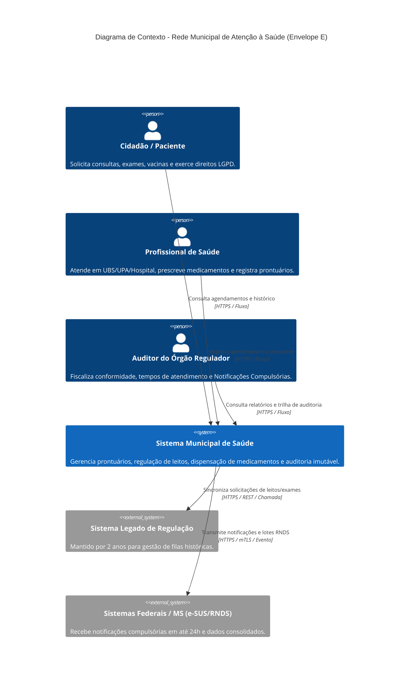
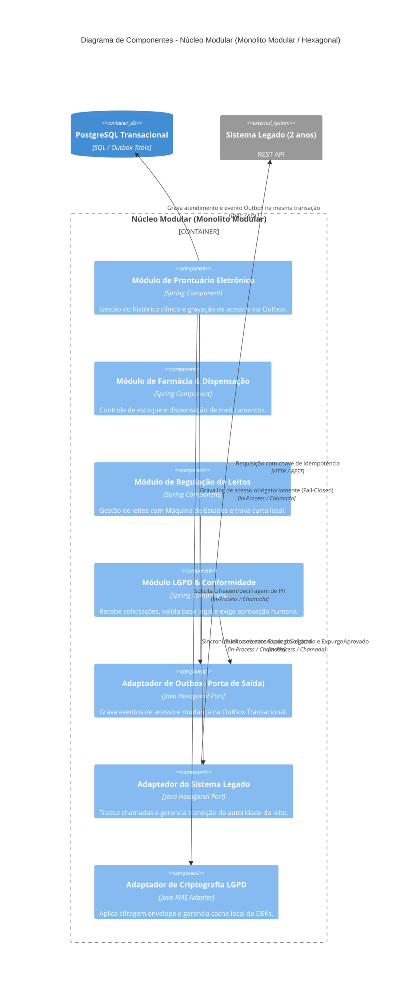

# 1. Diagramas C4:

## 1.1 Nível 1: Diagrama de Contexto

O Diagrama de Contexto estabelece as fronteiras do **Sistema Municipal de Saúde** no ecossistema da administração pública local e federal. Apresenta os atores humanos que interagem diretamente com a plataforma e os sistemas externos que consomem ou fornecem dados essenciais para a operação contínua do município.

### 1.1.1 Descrição dos atores e interações do contexto: 
- Cidadão / Paciente: Usuário final da rede pública de saúde municipal. Interage através de aplicações web/móveis para agendamento e acompanhamento de consultas, verificação do status em filas de regulação, histórico de imunizações e requisição formal de direitos previstos pela LGPD, tais como o acesso aos seus dados e a revogação de consentimento com solicitação de expurgo.
- Profissional de Saúde (Médicos, Enfermeiros, Triadores e Farmacêuticos): Operadores primários do sistema nas Unidades Básicas de Saúde (UBSs), Unidades de Pronto Atendimento (UPAs) e Hospitais Municipais. Realizam o acolhimento com classificação de risco (Protocolo de Manchester), preenchimento do Prontuário Eletrônico do Paciente (PEP), emissão de prescrições e registros de dispensação de fármacos.
- Auditor do Órgão Regulador: Agente responsável pela fiscalização da qualidade dos serviços prestados, cumprimento dos tempos regulamentares de atendimento nas emergências, verificação de integridade dos registros de prontuários e auditoria contínua das Notificações Compulsórias enviadas ao Ministério da Saúde.
- Sistema Legado de Regulação: Plataforma histórica utilizada pelo município para controle e distribuição de vagas em leitos hospitalares e procedimentos especializados. Será mantida em produção por um período de transição obrigatório de 24 meses até o completo estrangulamento de suas rotinas.
- Sistemas Federais / Ministério da Saúde (e-SUS / RNDS): Infraestrutura nacional centralizadora da Rede Nacional de Dados em Saúde (RNDS). O sistema municipal deve integrar-se obrigatoriamente para descarregar Notificações Compulsórias epidemiológicas no prazo máximo de 24 horas via conexões autenticadas por certificado digital de servidor (mTLS).

### 1.1.2 Análise das fronteiras e requisitos de negócio do contexto:
O ecossistema opera sob extrema pressão de conformidade regulatória e restrições de infraestrutura local:
1. Resiliência de Rede: As 70 UBSs municipais passam por quedas frequentes de conectividade. O sistema precisa absorver atendimentos locais sem interromper a operação primária dos profissionais de saúde.
2. Dupla Tutela Legal: Conflito entre a exigência de guarda dos registros sanitários e trilhas de auditoria por 20 anos pelo Conselho Federal de Medicina (CFM) e Ministério da Saúde contra o direito ao esquecimento e anonimização previstos na LGPD.
3. Escalabilidade Sazonal: Elevação exponencial no volume de acessos simultâneos durante campanhas sazonais de vacinação municipal sem comprometer os módulos transacionais de emergência das UPAs.

## 1.2 Nível 2: Diagrama de Contêineres

O Diagrama de Contêineres desagrega o **Sistema Municipal de Saúde** nas suas unidades de implantação, detalhando escolhas de frameworks, protocolos de comunicação, topologia de bancos de dados com Outbox Transacional e barramentos de mensagens.

```mermaid
C4Container
    title Diagrama de Contêineres - Sistema Municipal de Saúde (Revisado)

    Person(operador, "Usuários (Médicos, Atendentes, Auditores)", "Profissionais de saúde e fiscalização.")

    System_Boundary(b1, "Plataforma Municipal de Saúde (Nuvem Pública)") {
        Container(webApp, "Portal Web / SPA (Offline-First)", "React / PWA", "Interface para atendimento com cache local e log encadeado.")
        Container(apiGateway, "API Gateway / Ingress Controller", "Envoy / NGINX", "Autenticação, controle de taxa e roteamento.")
        
        Container(coreMonolith, "Núcleo Modular (Monolito Modular)", "Java / Spring Boot", "Módulos: Prontuário, Farmácia, Agendamento, Regulação e LGPD.")
        Container(relayService, "Relay Outbox Worker", "Java / Go", "Lê a Outbox Transacional e publica no Barramento de Eventos.")
        Container(eventBus, "Barramento de Eventos", "Apache Kafka", "Transmissão assíncrona de eventos, auditoria e notificações.")
        
        Container(auditService, "Serviço de Auditoria", "Go / Node.js", "Ingestão e validação da cadeia de hashes do histórico.")
        Container(pipelineService, "Pipeline Worker (Pipes & Filters)", "Python / Go", "Validação FHIR, controle de SLA 24h e envio à RNDS.")
        Container(serverlessWorker, "Serverless KMS Worker", "AWS Lambda / Cloud Functions", "Executa destruição de chaves no KMS mediante evento aprovado.")

        ContainerDb(dbCore, "Banco Transacional Central", "PostgreSQL", "Dados operacionais e Tabela de Outbox Transacional.")
        ContainerDb(dbAudit, "Store Imutável de Auditoria", "PostgreSQL Append-Only + WORM", "Log de auditoria particionado com Object Lock WORM (20 anos).")
        ContainerDb(dbKMS, "Gerenciador de Chaves (KMS)", "Vault / AWS KMS", "Guarda chaves de criptografia (DEKs) individuais por paciente.")
    }

    System_Ext(sistemaLegado, "Sistema Legado de Regulação", "HTTP / REST")
    System_Ext(ministerioSaude, "Ministério da Saúde (RNDS)", "HTTP / mTLS")

    Rel(operador, webApp, "Acessa via navegador / PWA", "HTTPS / Fluxo")
    Rel(webApp, apiGateway, "Requisições de API e Sincronização", "HTTPS / Chamada")
    Rel(apiGateway, coreMonolith, "Roteia chamadas transacionais", "HTTP / Chamada")
    
    Rel(coreMonolith, dbCore, "Escrita transacional e Outbox (Fail-Closed)", "SQL / JDBC")
    Rel(relayService, dbCore, "Lê eventos pendentes na Outbox", "SQL")
    Rel(relayService, eventBus, "Publica eventos de negócio e auditoria", "Kafka Protocol")
    
    Rel(eventBus, auditService, "Consome eventos para auditoria imutável", "Kafka Event")
    Rel(auditService, dbAudit, "Persiste com cadeia de hashes diária", "Append-Only SQL")
    
    Rel(eventBus, pipelineService, "Envia notificações compulsórias com relógio de SLA", "Kafka Event")
    Rel(pipelineService, ministerioSaude, "Transmite dados epidemiológicos em até 24h", "HTTPS / mTLS")
    
    Rel(eventBus, serverlessWorker, "Consome evento ExpurgoAprovado", "Kafka Event")
    Rel(serverlessWorker, dbKMS, "Destrói chaves do paciente sob consentimento/vencimento", "KMS API")
    Rel(coreMonolith, sistemaLegado, "Sincronização temporária por leito (2 anos)", "HTTP / Chamada")
```

### 1.2.1 Análise dos contêineres e fronteiras de comunicação:
- Portal Web / SPA (Progressive Web App - React): Interface enriquecida desenvolvida para rodar em navegadores modernos. Incorpora estratégia Offline-First com segregação clara: na UBS, realiza cache apenas de pacientes agendados no dia com DEKs de TTL curto; na UPA (demanda espontânea), registra o atendimento corrente em log local encadeado por hash, sincronizando via Relay Local assim que a conexão é reestabelecida.
- API Gateway / Ingress Controller (Envoy / NGINX): Ponto de entrada unificado no cluster da nuvem. Executa inspeção de segurança, encerramento TLS, autenticação baseada em tokens JWT/OAuth2, controle de taxa (Rate Limiting) e roteamento de tráfego.
- Núcleo Modular (Monolito Modular - Java / Spring Boot): Aplicação principal que encapsula os domínios de negócio essenciais (Prontuário Eletrônico, Regulação de Leitos, Farmácia, Agendamento e Módulo LGPD). Garantia de consistência e auditoria via Outbox Transacional no mesmo banco de dados.
- Relay Outbox Worker: Componente responsável por ler a tabela de Outbox do dbCore em intervalos de milissegundos e publicar os eventos de auditoria e negócio no Apache Kafka, eliminando totalmente o risco de Dual Write.
- Barramento de Eventos (Apache Kafka): Plataforma de mensageria assíncrona com alta taxa de transferência e garantia de entrega at-least-once. Isola as requisições de atendimento clínico da carga pesada de auditoria, notificações federais e destruição de chaves.
- Serviço de Auditoria (Go / Node.js): Consome eventos do Kafka, calcula a cadeia de hashes por partição diária e grava os registros de auditoria no repositório imutável.
- Pipeline Worker (Python / Go - Pipes & Filters): Processador assíncrono para validação FHIR e envio epidemiológico à RNDS. Controla o SLA de 24 horas a partir do timestamp do atendimento de origem, emitindo alertas em 12h e acionando contingência manual antes do estouro do prazo.
- Serverless Worker (AWS Lambda / Cloud Functions): Executor técnico isolado, acionado via evento ExpurgoAprovado. Executa exclusivamente a revogação/destruição de chaves no KMS, sem conter regras de negócio de aprovação.
- Bancos de Dados Segregados (PostgreSQL / PostgreSQL Append-Only + WORM / KMS): Tripla camada de dados que separa o estado operacional síncrono (OLTP), a trilha imutável protegida por Object Lock WORM e a gestão criptográfica de chaves de pacientes.

## 1.3 Nível 3: Diagrama de Componentes

O Diagrama de Componentes expõe a organização interna do **Núcleo Modular (Monolito Modular)**, demonstrando a aplicação dos princípios de Arquitetura Hexagonal (Ports & Adapters) e a inclusão do Módulo LGPD.

### 1.3.1 Detalhamento da arquitetura hexagonal e modularidade:
- Módulo de Prontuário Eletrônico: Encapsula as regras de domínio clínico (anamnese, evolução médica, diagnóstico ICD e prescrição). Qualquer leitura ou escrita aciona obrigatoriamente o auditAdapter dentro da mesma transação SQL local (Fail-Closed). Se a gravação do registro de acesso na Outbox falhar, a exibição ou alteração do prontuário é abortada.
- Módulo de Regulação de Leitos: Responsável pelo gerenciamento das solicitações de reserva, transferência e internação. Implementa uma Máquina de Estados explícita (SOLICITADA → PENDENTE_LEGADO → CONFIRMADA/RECUSADA) associada a travas curtas no PostgreSQL local, desacoplando a reserva de leitos da latência HTTP do sistema legado.
- Módulo de Farmácia & Dispensação: Gerencia o estoque de medicamentos nas unidades e valida a liberação de fármacos mediante apresentação de receita médica válida. Registra eventos de estado completo (medicamento, lote, dose, prescrição de origem) via auditAdapter.
- Módulo LGPD & Conformidade: Módulo dedicado no núcleo responsável pela recepção de solicitações de titulares de dados. Avalia a Base Legal (indeferindo o expurgo de prontuários sob guarda sanitária obrigatória de 20 anos) e exige a aprovação formal do Encarregado de Dados (DPO) antes de gravar os eventos ExpurgoSolicitado e ExpurgoAprovado na Outbox.
- Adaptador de Outbox (auditAdapter): Porta de saída hexagonal responsável por gravar registros de auditoria e eventos de domínio na tabela outbox do banco de dados operacional (dbCore), integrando a mesma transação do banco relacional.
- Adaptador do Sistema Legado (legadoAdapter): Camada de Anticorrupção (Anti-Corruption Layer - ACL) que converte comandos modernos de regulação em requisições REST/JSON para a aplicação antiga enquanto esta detiver a autoridade do leito, utilizando chaves de idempotência.
- Adaptador de Criptografia LGPD (cryptoAdapter): Intermedeia as operações entre os módulos de domínio e o KMS. Utiliza pseudônimos estáveis para identificar o paciente na trilha de auditoria sem expor seus dados PII diretos e gerencia o cache local seguro de chaves DEK.

# 2. Mapa de Restrições e Decisões:

A tabela a seguir apresenta o alinhamento sistemático entre as restrições do Envelope E e as decisões arquiteturais consolidadas após a leitura cruzada:

| Restrição do Envelope / Requisito do Caso | Decisão Arquitetural Adotada | Justificativa & Impacto Técnico / Operacional |
| :--- | :--- | :--- |
| **Fiscalização por Órgão Regulador e Guarda de 20 Anos** | **Log de Auditoria de Estado Completo via Outbox Transacional e WORM** | Garante reconstrução histórica sem *Dual Write*. Os eventos são gravados na Outbox do banco transacional, publicados no Kafka e armazenados em PostgreSQL Particionado com Object Lock WORM e cadeia de hashes. |
| **Direito ao Esquecimento / Expurgo LGPD vs. Imutabilidade da Trilha** | **Segregação por Base Legal e Criptografia Envelope com *Crypto-shredding*** | Dados sob obrigação legal (prontuários por 20 anos) não sofrem expurgo (Art. 16, I da LGPD). O *crypto-shredding* é aplicado apenas a dados por consentimento e ao fim do prazo de 20 anos. A trilha usa pseudônimos estáveis para manter a auditabilidade. |
| **Notificações Compulsórias em até 24h** | **Pipeline em Dutos e Filtros (*Pipes & Filters*) com Relógio de SLA** | O pipeline valida schemas FHIR e controla o SLA de 24h a partir do *timestamp* do atendimento de origem, com alertas em 12h e contingência manual. A anonimização foi removida para garantir a identificação pela vigilância. |
| **70 UBSs com Conectividade Instável** | **Arquitetura Offline-First Segregada com Log Encadeado Local** | A UBS faz cache apenas dos agendados do dia (DEKs com TTL curto). A UPA registra atendimentos espontâneos em log local encadeado por hash e sincroniza ao reconectar, sem pré-carga de prontuários. |
| **Equipe Reduzida (15 devs e 1 auditor/conformidade)** | **Composição Híbrida centrada em Monolito Modular Hexagonal** | Evita a complexidade operacional de microsserviços. Concentra as regras de negócio e aprovação LGPD no núcleo monolítico e utiliza PostgreSQL Particionado para simplificar a operação. |
| **Manutenção do Sistema Legado por 2 Anos** | **Máquina de Estados e Decoupling Transacional (ADR 06)** | Elimina travas de banco retidas durante chamadas HTTP. A disputa de leitos é resolvida por transações curtas no banco local e a sincronização com o legado ocorre via estados assíncronos reconciliados. |
| **Picos de Acesso em Campanhas Sazonais de Vacinação** | **Manutenção no Núcleo Modular com Previsão de Extração Isolada** | O agendamento permanece no monolito. Caso haja necessidade comprovada de escala durante eventos de massa, o módulo pode ser implantado isoladamente sem alterar o domínio. |

---

### 2.1 Análise Aprofundada da Composição Híbrida e Trade-offs

A definição do estilo arquitetural híbrido responde diretamente ao cenário de restrição orçamentária e operacional de um município de médio/grande porte:

1. **Garantia de Não-Repúdio sem Dual Write:** A adoção do padrão *Transactional Outbox* garante que 100% das leituras e escritas em prontuários sejam auditadas. Se o banco relacional persistir o atendimento, persiste também o evento de auditoria no mesmo *commit*.
2. **Segregação de Privilégios no Expurgo:** O Módulo LGPD no monolito concentra a validação legal e aprovação humana do Encarregado de Dados. O *Serverless Worker* atua como mero executor sem privilégios de regra de negócio, invocando o KMS para destruir a chave.
3. **Resiliência e Desempenho Regional:** Ao limitar o cache offline da UBS aos pacientes agendados e proibir a pré-carga de histórico na UPA, elimina-se o risco de vazamento de prontuários em navegadores locais.

# 3. Registros de Decisão Arquitetural (ADRs):

---

### ADR 01: Estrutura Geral – Composição Híbrida com Núcleo Monolítico Modular e Fronteiras Explícitas

* **Status:** Aprovado
* **Contexto:** A equipe de desenvolvimento possui apenas 15 pessoas e 1 especialista em conformidade. Adotar microsserviços puros traria alta complexidade operacional e overhead de DevOps. Contudo, partes do sistema possuem dinâmicas de carga e modelos de execução distintos.
* **Decisão:** Adotar uma composição híbrida de estilos arquiteturais com delimitação explícita das seguintes fronteiras:
  1. **Núcleo Transacional (Monolito Modular com Arquitetura Hexagonal):** Processa as operações síncronas dos domínios core (Prontuário, Farmácia, Regulação, Agendamento e Módulo LGPD) via chamadas *In-Process*.
  2. **Fronteira Assíncrona via EDA (Event-Driven Architecture):** Delimitada na saída do Monolito por uma Outbox Transacional e um Relay Worker que publica eventos no Apache Kafka.
  3. **Fronteira de Processamento de Dados (Pipes & Filters):** Executada por um Worker dedicado para validação FHIR e transmissão assíncrona com controle de SLA à RNDS.
  4. **Fronteira Serverless:** Execuções técnicas pontuais acionadas por eventos para destruição de chaves no KMS e relatórios esporádicos.
* **Alternativas Consideradas:**
  * *Arquitetura de Microsserviços Puros:* Descartada devido à alta complexidade de implantação e governança incompatível com o tamanho da equipe (15 devs).
  * *Monolito Tradicional (N-Tier sem separação modular):* Descartado por favorecer o acoplamento descontrolado do código e inviabilizar a transição gradual do sistema legado.
* **Consequências Positivas:**
  * Baixa complexidade de implantação e manutenção do núcleo do sistema.
  * Fronteiras claras delimitando a transição entre execuções síncronas e assíncronas.
* **Consequências Negativas:**
  * Exige disciplina no *Code Review* para manter a separação dos módulos internos no monolito.

---

### ADR 02 (Revisado): Gestão de Dados – Classificação por Base Legal e Crypto-Shredding

* **Status:** Aprovado (Substitui o ADR 02 original)
* **Contexto:** A legislação sanitária (Lei 13.787/2018 e CFM) exige a guarda imutável de prontuários por 20 anos. Por outro lado, a LGPD concede ao cidadão o direito ao expurgo de dados pessoais. O expurgo genérico sobre prontuários dentro do prazo legal violaria obrigações regulatórias.
* **Decisão:**
  1. **Classificação por Base Legal:** Dados sob obrigação legal de guarda (prontuários, dispensações e notificações) não sofrem *crypto-shredding* durante o prazo legal de 20 anos. Pedidos de expurgo nesses casos recebem resposta fundamentada no Art. 16, I da LGPD.
  2. **Crypto-Shredding Restrito:** O *crypto-shredding* (destruição da DEK no KMS) é aplicado estritamente a dados tratados sob consentimento e para a eliminação definitiva de prontuários após o vencimento do prazo prescricional de 20 anos.
  3. **Pseudônimos Estáveis na Trilha:** Os eventos de auditoria gravam um identificador pseudônimo estável do paciente (desvinculado da DEK), garantindo que a trilha de acessos continue consultável por auditores mesmo após o eventual expurgo dos dados PII diretos.
* **Alternativas Consideradas:**
  * *Crypto-Shredding Irrestrito em Todos os Prontuários:* Descartado por violar a obrigação legal de guarda de 20 anos e impossibilitar a auditoria sanitária.
  * *Hard Delete em Tabelas Relacionais:* Descartado por violar a imutabilidade do repositório de auditoria.
* **Consequências Positivas:**
  * Conformidade integral com a Lei de Prontuários Eletrônicos e com a LGPD.
  * Preservação da auditabilidade do histórico de acessos através de pseudônimos.
* **Consequências Negativas:**
  * Necessidade de validação jurídica/conformidade prévia para cada solicitação de expurgo no Módulo LGPD.

---

### ADR 03 (Revisado): Ingestão de Notificações Compulsórias e Prazos da Vigilância

* **Status:** Aprovado (Substitui o ADR 03 original)
* **Contexto:** O sistema precisa transmitir Notificações Compulsórias ao Ministério da Saúde (RNDS) no prazo impreterível de 24 horas, superando instabilidades nas redes de 70 UBSs. A vigilância epidemiológica exige a identificação do paciente para ações de contenção sanitária.
* **Decisão:** Adotar a arquitetura **Pipes & Filters (Dutos e Filtros)** acoplada ao Apache Kafka com as seguintes regras:
  1. **Remoção da Anonimização:** A etapa de anonimização é removida do pipeline epidemiológico (respaldada pelo Art. 11, II da LGPD - tutela da saúde).
  2. **Relógio de SLA de 24 Horas:** O prazo de 24h é contado rigidamente a partir do *timestamp* do atendimento de origem.
  3. **Alertas e Contingência:** Emissão de alerta preventivo com 12h de atraso e acionamento de canal de contingência manual auditado antes do vencimento do prazo.
* **Alternativas Consideradas:**
  * *Anonimização de Notificações Epidemiológicas:* Descartada por inviabilizar o trabalho da vigilância sanitária em identificar e isolar surtos.
  * *Integração Síncrona Direta HTTP:* Descartada pois indisponividades federais travavam o atendimento médico nas UPAs.
* **Consequências Positivas:**
  * Cumprimento garantido do prazo regulatório com rastreabilidade de SLA.
  * Pleno atendimento às necessidades da vigilância epidemiológica.
* **Consequências Negativas:**
  * Necessidade de gestão de alertas operacionais e monitoramento de Dead Letter Queues (DLQ).

---

### ADR 04 (Revisado): Operação Offline-First e Políticas de Cache em UBS/UPA

* **Status:** Aprovado (Substitui o ADR 04 original)
* **Contexto:** As 70 UBSs e 5 UPAs enfrentam perdas frequentes de conectividade. Contudo, armazenar históricos completos de prontuários em navegadores locais gera graves riscos de vazamento de PII.
* **Decisão:** Implementar a arquitetura **Offline-First com Buffer Local** com políticas segregadas:
  1. **Unidades Básicas de Saúde (UBS):** Cache local restrito estritamente aos pacientes agendados no dia. Chaves DEK em cache com TTL curto, descartadas imediatamente após a sincronização.
  2. **Unidades de Pronto Atendimento (UPA):** Sem pré-carga de prontuários devido à demanda espontânea. O atendimento corrente é registrado localmente em um log *append-only* encadeado por hash e sincronizado assim que a conexão retorna.
  3. **Trilha de Origem:** Transações offline entram no repositório central marcadas com a origem offline e seu *timestamp* original.
* **Alternativas Consideradas:**
  * *Pré-carga Global de Prontuários na UPA:* Descartada pelo risco inaceitável de vazamento de dados PII em navegadores locais.
  * *Operação 100% Online:* Descartada pela inviabilidade prática de paralisar atendimentos durante quedas de link.
* **Consequências Positivas:**
  * Continuidade do atendimento médico sem expor históricos clínicos desnecessários em cache local.
  * Rastreabilidade e integridade dos registros gerados offline via log encadeado.
* **Consequências Negativas:**
  * Durante a perda de rede na UPA, o médico não tem acesso ao histórico anterior do paciente.

---

### ADR 05 (Revisado): Segregação de Banco Transacional e Store Imutável com Outbox Transacional e WORM

* **Status:** Aprovado (Substitui o ADR 05 original)
* **Contexto:** Registrar a trilha detalhada de acessos diretamente no banco operacional (OLTP) degrada severamente a performance. Por outro lado, enviar auditorias via chamadas assíncronas simples cria risco de *Dual Write* e perda de mensagens.
* **Decisão:**
  1. **Outbox Transacional:** Todas as leituras e escritas auditáveis gravam o evento na tabela `outbox` do banco `dbCore` dentro da mesma transação SQL local (*Fail-Closed*).
  2. **Log de Auditoria com Eventos de Estado Completo:** A gravação na Outbox emite o estado completo da alteração (valores antes e depois, prescrição, dose, lote).
  3. **Armazenamento Imutável WORM:** Os eventos são consumidos do Kafka e armazenados em um **PostgreSQL Particionado Append-Only**, onde o hash de fechamento de cada lote diário é persistido em armazenamento WORM (Object Lock em modo compliance).
* **Alternativas Consideradas:**
  * *Event Sourcing Estrito em Todo o Sistema:* Descartado pela complexidade de projeções, versionamento de eventos e replay sobre a equipe de 15 devs.
  * *EventStoreDB como Banco Adicional:* Descartado para não adicionar mais uma tecnologia de banco à carga de trabalho da equipe.
* **Consequências Positivas:**
  * Eliminação total do problema de *Dual Write* e garantia de não-repúdio nas leituras de prontuário.
  * Imutabilidade garantida por hardware/storage WORM e cadeia de hashes.
* **Consequências Negativas:**
  * Pequeno overhead de escrita na tabela de Outbox durante as transações operacionais.

---

### ADR 06 (NOVO): Regulação de Leitos com Máquina de Estados e Decoupling Transacional

* **Status:** Aprovado (Novo ADR)
* **Contexto:** Reter locks pessimistas ou distribuídos no banco local durante chamadas HTTP síncronas ao sistema legado de regulação provoca contenção de conexões, travamento de leitos e risco de reservas fantasmas em caso de timeout.
* **Decisão:**
  1. **Desacoplamento de Locks HTTP:** Fica proibida a retenção de travas de banco durante chamadas externas ao legado.
  2. **Máquina de Estados de Reserva:** A reserva de leito adota os estados `SOLICITADA` → `PENDENTE_LEGADO` → `CONFIRMADA`/`RECUSADA`.
  3. **Resolução Local Concorrente:** Duas unidades disputando o mesmo leito têm a concorrência resolvida por uma transação curta no banco local (constraint de unicidade/versão). Apenas a unidade que obter o estado `PENDENTE_LEGADO` invoca o sistema legado.
  4. **Autoridade do Leito:** O legado detém a autoridade sobre o leito apenas durante a fase de transição; após a migração daquele leito, a autoridade passa a ser 100% nativa do núcleo.
* **Alternativas Consideradas:**
  * *Lock Pessimista Mantido Durante Chamada HTTP ao Legado:* Descartado pelo risco de travar o banco e gerar inconsistências em caso de timeout de rede.
* **Consequências Positivas:**
  * Desempenho transacional e eliminação de gargalos no gerenciamento de leitos.
  * Tratamento resiliente de timeouts através de reconciliação assíncrona por chave de idempotência.
* **Consequências Negativas:**
  * Necessidade de gerenciar a máquina de estados e rotinas de reconciliação de reservas pendentes.
    
---

# 4. Respostas às Perguntas Obrigatórias do Caso:

### 1. Como a UPA continua triando e atendendo com a internet fora do ar, e o que acontece quando ela volta?

* **Resposta:** A UPA utiliza a arquitetura **Offline-First com Buffer Local**. Por se tratar de atendimento de demanda espontânea, a UPA opera sem pré-carga de prontuários históricos em cache para evitar vazamentos de dados pessoais em navegadores. Durante a queda de rede, a aplicação registra os atendimentos correntes em um log local encadeado por hash (*IndexedDB*). Cada registro recebe um UUID e *timestamp* original do atendimento. Ao restabelecer a conexão, o agente de sincronização descarrega os eventos acumulados no **Apache Kafka**. A reconciliação ordena os eventos pelo *timestamp* de origem e persiste as transações no **Banco Transacional Central**, marcando a origem offline na trilha.
* **Sustentado por:**
  * **Diagramas C4:** Nível 2 (Componentes *Portal Web / SPA Offline-First* e *Barramento de Eventos*).
  * **ADRs:** ADR 04 (Operação e Implantação – Operação Offline-First e Políticas de Cache em UBS/UPA).

---

### 2. Como duas unidades disputando o mesmo leito nunca conseguem reservá-lo ao mesmo tempo, com o sistema legado ainda no circuito?

* **Resposta:** A disputa é resolvida pelo **Módulo de Regulação de Leitos** através de uma **Máquina de Estados** e travas transacionais curtas no banco local. Ao solicitar o leito, o sistema tenta transicionar o estado do leito para `PENDENTE_LEGADO` via uma transação rápida no **PostgreSQL Transacional**. Apenas a unidade que obtiver êxito nessa transação local dispara a chamada HTTP ao **Sistema Legado de Regulação** através do **legadoAdapter**, utilizando uma chave de idempotência. Se outra unidade tentar a mesma vaga simultaneamente, a transação local rejeita o pedido imediatamente, eliminando a retenção de travas de banco durante chamadas externas.
* **Sustentado por:**
  * **Diagramas C4:** Nível 2 (*Core Monolith* e *Sistema Legado*) e Nível 3 (*Módulo de Regulação de Leitos* e *legadoAdapter*).
  * **ADRs:** ADR 03 (Integração com Legado) e ADR 06 (Regulação de Leitos com Máquina de Estados e Decoupling Transacional).

---

### 3. Como o prontuário garante que se saiba quem acessou cada registro, e como convive a guarda de 20 anos com os direitos do paciente sob a LGPD?

* **Resposta:** Qualquer leitura ou escrita no prontuário grava obrigatoriamente um registro de acesso na tabela `outbox` do banco de dados operacional dentro da mesma transação SQL (*Fail-Closed*). O **Relay Worker** publica o evento no **Kafka**, que é persistido no **Store Imutável de Auditoria (PostgreSQL Particionado + WORM)** com pseudônimos estáveis do paciente, garantindo a rastreabilidade por 20 anos. Quanto à LGPD, o **Módulo LGPD** classifica os dados por base legal: prontuários sob obrigação sanitária de guarda de 20 anos não sofrem expurgo (Art. 16, I da LGPD). O *crypto-shredding* (destruição da chave no KMS) é aplicado estritamente a dados tratados por consentimento e ao fim do prazo prescricional de 20 anos.
* **Sustentado por:**
  * **Diagramas C4:** Nível 2 (*Outbox Transacional*, *Serviço de Auditoria* e *KMS*) e Nível 3 (*Módulo LGPD*, *auditAdapter* e *cryptoAdapter*).
  * **ADRs:** ADR 02 (Classificação por Base Legal e Crypto-Shredding) e ADR 05 (Outbox Transacional e Store WORM).

---

### 4. Como a notificação compulsória chega à vigilância em até 24 horas mesmo se o sistema federal estiver indisponível?

* **Resposta:** A notificação é processada via **Pipes & Filters** desacoplados. Ao registrar um diagnóstico compulsório, a Outbox publica o evento no **Kafka**. O **Pipeline Worker** consome a mensagem, valida a estrutura FHIR (sem anonimizar o paciente, respaldado pela tutela da saúde) e tenta o envio à RNDS. O sistema mantém um relógio de SLA contado a partir do *timestamp* do atendimento de origem. Se o serviço federal estiver fora do ar, o worker aplica retentativas com backoff exponencial. Se a indisponibilidade atingir 12 horas, um alerta preventivo é enviado à vigilância municipal; antes de completar 24 horas, aciona-se um canal de contingência manual auditado.
* **Sustentado por:**
  * **Diagramas C4:** Nível 2 (*EventBus*, *Pipeline Worker* e *Sistemas Federais / MS*).
  * **ADRs:** ADR 03 (Ingestão de Notificações Compulsórias e Prazos da Vigilância).

---

### 5. Como o sistema legado de regulação é substituído aos poucos sem interromper o serviço?

* **Resposta:** A substituição gradual adota o padrão **Strangler Fig (Estrangulamento)** combinado com a transferência de autoridade por leito. Inicialmente, o **Módulo de Regulação de Leitos** delega a autoridade do leito ao sistema antigo através do `legadoAdapter`. Conforme os leitos e unidades são migrados nativamente para a nova plataforma, a autoridade do leito passa a ser do núcleo e o adaptador passa a operar apenas em modo de consulta histórica via *Feature Toggles*. Ao final dos 24 meses, o adaptador é desativado e o legado desligado sem qualquer impacto operacional.
* **Sustentado por:**
  * **Diagramas C4:** Nível 2 (*Core Monolith* e *Sistema Legado*) e Nível 3 (*Módulo de Regulação de Leitos* e *legadoAdapter*).
  * **ADRs:** ADR 01 (Estrutura Geral), ADR 03 (Padrão Adapter) e ADR 06 (Máquina de Estados e Autoridade do Leito).
