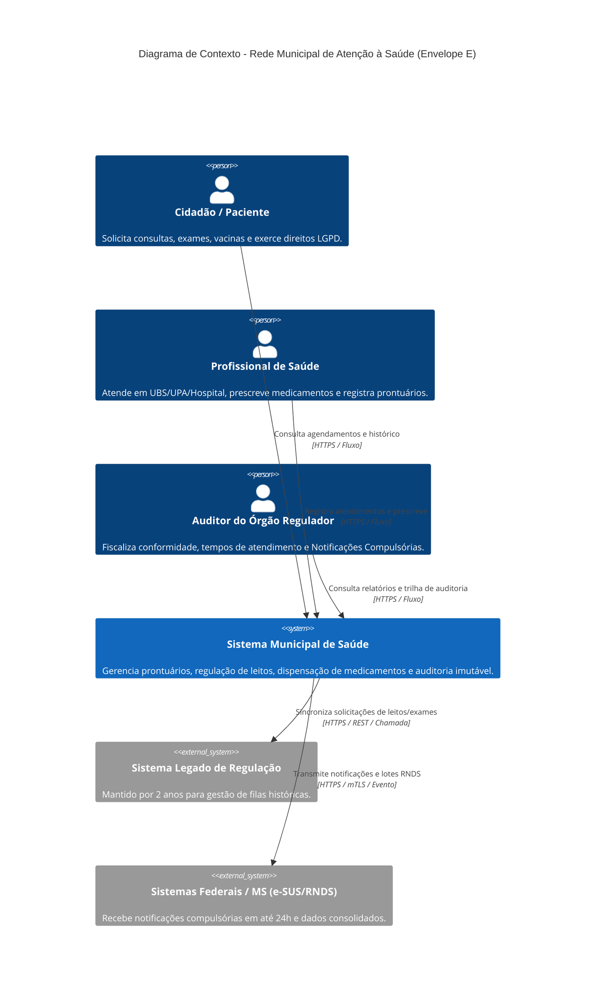
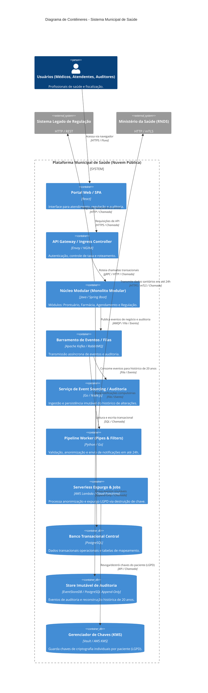
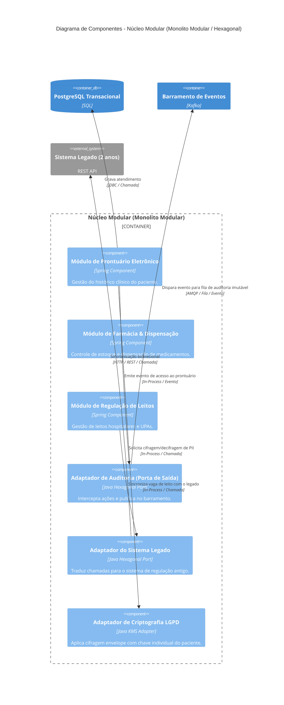

# 1. Diagramas C4:

## 1.1 Nível 1: Diagrama de Contexto

## 1.2 Nível 2: Diagrama de Contêineres

## 1.3 Nível 3: Diagrama de Componentes

# 2. Mapa de restrições e decisões:

| Restrição do Envelope / Requisito do Caso | Decisão Arquitetural Adotada | Justificativa & Impacto |
| :--- | :--- | :--- |
| **Fiscalização por Órgão Regulador e Guarda de 20 Anos** | **Event Sourcing na Trilha de Auditoria com Store Imutável Segregado** | Garante imutabilidade absoluta e reconstrução histórica das alterações operacionais sem sobrecarregar o banco OLTP. |
| **Direito ao Esquecimento / Expurgo LGPD vs. Imutabilidade da Trilha** | **Criptografia Envelope com Destruição Criptográfica de Chaves (*Crypto-shredding*)** | Dados PII são cifrados com chave individual mantida no KMS. Ao revogar o consentimento, a chave é destruída, tornando o dado ilegível na base imutável. |
| **Notificações Compulsórias em até 24h** | **Pipeline em Dutos e Filtros (*Pipes & Filters*) com Filas Assíncronas** | Garante validação, anonimização e retentativas automáticas no envio ao Ministério da Saúde (RNDS) sem bloquear o atendimento da UPA. |
| **70 UBSs com Conectividade Instável** | **Arquitetura Offline-First com Buffer Local (*Store and Forward*)** | Permite registrar atendimentos localmente (IndexedDB/SQLite local) e descarregar no barramento central quando a conexão retorna. |
| **Equipe Reduzida (15 devs e 1 auditor/conformidade)** | **Composição Híbrida centrada em Monolito Modular Hexagonal** | Evita a complexidade de dezenas de microsserviços, mantendo isolamento de domínios dentro do mesmo processo. |
| **Manutenção do Sistema Legado por 2 Anos** | **Padrão *Adapter* / *Strangler Fig* via Arquitetura Hexagonal** | Isola o legado da nova arquitetura, permitindo substituição progressiva e desligamento em 24 meses sem parar o serviço. |
| **Picos de Acesso em Campanhas Sazonais de Vacinação** | **Extração do Módulo de Agendamento em Serviços Elasticamente Escaláveis** | Permite responder a picos de tráfego pontuais sem redimensionar todo o ecossistema. |

# 3. ADRs:
---

### ADR 01: Estrutura Geral – Composição Híbrida com Núcleo Monolítico Modular e Fronteiras Explícitas

* **Status:** Aprovado
* **Contexto:** A equipa de desenvolvimento possui apenas 15 pessoas e 1 especialista em conformidade. Adotar microsserviços puros traria alta complexidade operacional. Contudo, partes do sistema exigem modelos de execução distintos (processamento em tempo real vs. assíncrono vs. execução orientada a eventos por demanda)[cite: 6].
* **Decisão:** Adotar uma composição híbrida de estilos arquiteturais, definindo rigidamente as seguintes fronteiras[cite: 6]:
  1. **Núcleo Transacional (Monolito Modular com Arquitetura Hexagonal):** Cobre os domínios core (Prontuário, Farmácia, Regulação e Agendamento). Comunicação interna *In-Process* síncrona.
  2. **Fronteira Assíncrona via EDA (Event-Driven Architecture):** Delimitada na saída do Monolito através de Portas/Adaptadores que publicam eventos no Barramento de Eventos (Kafka)[cite: 6].
  3. **Fronteira de Processamento de Dados (Pipes & Filters):** Executada por um Worker separado responsável pela ingestão e transmissão assíncrona ao Ministério da Saúde[cite: 6].
  4. **Fronteira Serverless:** Execuções pontuais de expurgo LGPD disparadas via eventos/crons[cite: 6].
* **Alternativas Consideradas:**
  * *Arquitetura de Microsserviços Puros:* Descartada devido ao alto custo de infraestrutura e sobrecarga de governança/DevOps desproporcional ao tamanho do time (15 devs).
  * *Monolito Tradicional (Camadas N-Tier sem isolamento modular):* Descartado por criar alto risco de acoplamento de código e impossibilitar a substituição futura do legado e a segregação de auditoria.
* **Consequências Positivas:**
  * Baixa complexidade de implantação do Core com isolamento claro de domínios.
  * Fronteiras rígidas e documentadas onde termina o código síncrono e começa o fluxo assíncrono[cite: 6].
* **Consequências Negativas:**
  * Requer disciplina do time para manter a separação dos módulos no monolito e não violar as fronteiras de dados.

---
### ADR 02: Gestão de Dados – Criptografia Envelope com Destruição de Chaves para LGPD vs. Auditoria Imutável

* **Status:** Aprovado
* **Contexto:** Legislações de saúde exigem guarda imutável de prontuários e acessos por 20 anos. Por outro lado, a LGPD garante ao cidadão o direito à anonimização/expurgo de dados pessoais PII. Alterar registos na base imutável quebraria a integridade da auditoria.
* **Decisão:** Implementar **Criptografia Envelope (*Envelope Encryption*)** gerenciada por um KMS (Key Management System). Cada paciente possui uma Data Encryption Key (DEK) individual. Os logs e prontuários armazenam os dados PII cifrados. Ao receber uma solicitação válida de expurgo sob a LGPD, a chave DEK do paciente é irreversivelmente destruída (**Crypto-shredding**).
* **Alternativas Consideradas:**
  * *Apagar/Atualizar diretamente os registros na base (*Hard Delete*):* Descartado por violar a imutabilidade do repositório de auditoria e inviabilizar a reconstrução histórica exigida pelos órgãos reguladores.
  * *Mascaramento de Dados via Anonymization SQL Scripts:* Descartado por alto risco de falha humana e impossibilidade de aplicar em bancos imutáveis *Append-Only* como EventStoreDB.
* **Consequências Positivas:**
  * Atende 100% à exigência legal de auditoria imutável por 20 anos e à conformidade LGPD.
  * O expurgo do dado torna-se uma operação instantânea no KMS.
* **Consequências Negativas:**
  * *Overhead* computacional para cifrar e decifrar dados sensíveis em runtime.
  * Alta dependência da disponibilidade e segurança do serviço KMS.

---
### ADR 03: Integração com Legado/Terceiros – Padrão Adapter e Ingestão Assíncrona via Pipes & Filters

* **Status:** Aprovado
* **Contexto:** O sistema precisa integrar-se com o Sistema Legado de Regulação durante uma transição de 2 anos e transmitir notificações compulsórias ao Ministério da Saúde em até 24h, superando instabilidades nas redes de 70 UBSs.
* **Decisão:** Adotar o padrão **Adapter (Portas e Adaptadores)** para isolar as chamadas REST/SQL ao sistema legado e a arquitetura **Pipes & Filters (Dutos e Filtros)** conectada ao Barramento de Eventos para a ingestão e envio assíncrono das notificações compulsórias ao Ministério da Saúde.
* **Alternativas Consideradas:**
  * *Integração Direta via Chamadas Síncronas (HTTP REST):* Descartada porque indisponividades no Ministério da Saúde ou falhas de internet na UPA travavam o fluxo de atendimento médico.
  * *Acesso Direto ao Banco de Dados do Sistema Legado:* Descartado por alto risco de corrupção de dados e acoplamento com a estrutura da base antiga.
* **Consequências Positivas:**
  * Permite o desligamento do sistema legado ao fim de 24 meses apenas removendo o Adaptador.
  * Tolerância a falhas: a indisponibilidade do sistema federal não interrompe a operação local e garante o envio dentro das 24 horas via *Retries*.
* **Consequências Negativas:**
  * Exige monitorização ativa e gestão de filas de mensagens com falhas (*Dead Letter Queue*).

---
### ADR 04: Operação e Implantação – Infraestrutura Cloud Híbrida com Buffer Local em UBSs

* **Status:** Aprovado
* **Contexto:** A plataforma central opera em nuvem, mas 70 Unidades Básicas de Saúde (UBSs) sofrem com conexões de internet instáveis. Os atendimentos médicos e triagens não podem ser paralisados por queda de rede.
* **Decisão:** Adotar uma arquitetura de **Buffer Local (*Offline-first / Store and Forward*)** nas UBSs. A aplicação web/local grava as transações emergenciais num armazenamento local (IndexedDB no navegador / SQLite local) durante a indisponibilidade e retransmite-as assincronamente para a nuvem assim que a conectividade for restabelecida.
* **Alternativas Consideradas:**
  * *Dependência Exclusiva de Conectividade Cloud (Online-only):* Descartada devido à inviabilidade operacional nas 70 UBSs com instabilidade de rede recorrente.
  * *Servidores Locais Completos em cada UBS (Full On-Premise):* Descartado pelo custo elevado de hardware, manutenção presencial e complexidade de sincronização bidirecional completa.
* **Consequências Positivas:**
  * Alta resiliência: atendimento contínuo mesmo durante quedas longas de internet.
  * Otimização do uso de banda de rede.
* **Consequências Negativas:**
  * Necessidade de gerir algoritmos de resolução de conflitos de dados no momento da sincronização.

---
### ADR 05: Decisão Mais Arriscada – Segregação Estrutural entre Banco Transacional Central e Store Imutável de Auditoria

* **Status:** Aprovado
* **Contexto:** O sistema lida com alto volume transacional concorrente. Gravar audit trails detalhados no mesmo banco operacional (OLTP) por 20 anos causa degradação acentuada de I/O, *locks* de tabela e gargalos severos de desempenho no atendimento das UPAs.
* **Decisão:** **Segregação Física de Armazenamento:** utilizar um banco de dados relacional transacional (PostgreSQL) focado no estado atual da aplicação e um repositório imutável *Append-Only* dedicado (EventStoreDB / PostgreSQL particionado) para auditoria e *Event Sourcing*, sincronizados assincronamente via barramento de eventos.
* **Alternativas Consideradas:**
  * *Banco de Dados Único com Tabelas de Trilha/Auditoria:* Descartado pelo elevado risco de degradação da performance transacional das UPAs e custos massivos de armazenamento em discos de alta velocidade.
  * *Auditoria via Text Logs (Arquivos de Log puros em S3):* Descartado por dificultar consultas estruturadas exigidas por auditores e órgãos fiscalizadores.
* **Consequências Positivas:**
  * Excelente performance e baixo tempo de resposta nas operações clínicas críticas das UPAs/UBSs.
  * Guarda imutável, estruturada e otimizada por 20 anos no repositório dedicado.
* **Consequências Negativas (Risco Elevado):**
  * *Consistência Eventual:* Risco temporário de um atendimento ser persistido no banco operacional, mas o registro de auditoria demorar alguns segundos para ser refletido no *Store Imutável*.
  * Exige mecanismos rigorosos de auditoria de mensagens e *re-drive* para garantir perda zero de eventos.

---

## 4. Respostas às Perguntas Obrigatórias do Caso:

### 1. Como a UPA continua triando e atendendo com a internet fora do ar, e o que acontece quando ela volta?

* **Resposta:** A UPA utiliza uma arquitetura **Offline-First com Buffer Local (*Store and Forward*)**. Durante a queda de conectividade, a aplicação armazena localmente em cache/banco local (IndexedDB no navegador ou SQLite local) os dados de triagem e atendimento. Quando a conexão restabelece, o agente de sincronização dispara o envio assíncrono dos eventos acumulados para o **Barramento de Eventos (Kafka)** na nuvem. A reconciliação ocorre ordenando os eventos pelo *timestamp* original do atendimento e aplicando regras de resolução de conflitos para garantir a consistência no **Banco Transacional Central**.
* **Sustentado por:**
  * **Diagramas C4:** Nível 2 (Componentes *Serverless Worker* e *Barramento de Eventos*).
  * **ADRs:** ADR 04 (Operação e Implantação – Infraestrutura Cloud Híbrida com Buffer Local).

---
### 2. Como duas unidades disputando o mesmo leito nunca conseguem reservá-lo ao mesmo tempo, com o sistema legado ainda no circuito?

* **Resposta:** A reserva única é garantida pelo **Módulo de Regulação de Leitos** através de **Bloqueio Pessimista Transacional (*Pessimistic Locking*)** ou **Locks Distribuídos** no banco central. Quando uma unidade solicita o leito, a transação obtém uma trava exclusiva sobre o ID do leito antes de invocar o **Sistema Legado de Regulação** através do **Adaptador do Sistema Legado (Padrão Adapter)**. A confirmação do legado encerra a transação. Caso outra unidade tente o mesmo leito simultaneamente, a requisição fica bloqueada até a liberação do lock, recebendo em seguida a notificação de leito indisponível.
* **Sustentado por:**
  * **Diagramas C4:** Nível 2 (Integração entre *Core Monolith* e *Sistema Legado* via REST) e Nível 3 (Componentes *Módulo de Regulação* e *Adaptador do Sistema Legado*).
  * **ADRs:** ADR 03 (Integração com Legado/Terceiros) e ADR 05 (Decisão Mais Arriscada - Banco Transacional Central com Locking).

---
### 3. Como o prontuário garante que se saiba quem acessou cada registro, e como convive a guarda de 20 anos com os direitos do paciente sob a LGPD?

* **Resposta:** O rastreamento de acessos é garantido pelo **Serviço de Event Sourcing / Auditoria**, que intercepta leituras e escritas via **Adaptador de Auditoria** e grava eventos imutáveis em repositório dedicado (**EventStoreDB/PostgreSQL Append-Only**) por 20 anos. Para cumprir a LGPD (direito ao esquecimento/expurgo), utiliza-se **Criptografia Envelope com *Crypto-shredding***: os dados PII são cifrados com chave individual mantida no **KMS**. Ao processar o expurgo LGPD, a chave do paciente é destruída no KMS. O log imutável permanece íntegro para fiscalização regulatória, contudo os dados do prontuário tornam-se indecifráveis/anonimizados.
* **Sustentado por:**
  * **Diagramas C4:** Nível 2 (Interação entre *Barramento de Eventos*, *Serviço de Auditoria*, *Store Imutável* e *KMS*) e Nível 3 (Componentes *Adaptador de Auditoria* e *Adaptador de Criptografia LGPD*).
  * **ADRs:** ADR 02 (Gestão de Dados – Criptografia Envelope com Destruição de Chaves) e ADR 05 (Separação do Store Imutável).

---
### 4. Como a notificação compulsória chega à vigilância em até 24 horas mesmo se o sistema federal estiver indisponível?

* **Resposta:** A notificação é processada via **Pipes & Filters (Dutos e Filtros)** de forma assíncrona. Ao registrar um diagnóstico compulsório, o evento é publicado no **Barramento de Eventos (Kafka)**. O **Pipeline Worker** consome a mensagem, valida, anonimiza e tenta a transmissão via HTTPS/mTLS para o sistema do Ministério da Saúde (e-SUS/RNDS). Em caso de indisponibilidade federal, o worker aplica **Retentativas com Backoff Exponencial** utilizando filas de espera (*Retry Queues*). As mensagens permanecem persistidas na fila e são entregues automaticamente quando o serviço federal reestabelece a operação, cumprindo o prazo legal de 24 horas.
* **Sustentado por:**
  * **Diagramas C4:** Nível 2 (Conexão assíncrona entre *EventBus*, *Pipeline Worker* e *Sistemas Federais / MS*).
  * **ADRs:** ADR 03 (Integração com Legado/Terceiros – Ingestão Assíncrona via Pipes & Filters).

---
### 5. Como o sistema legado de regulação é substituído aos poucos sem interromper o serviço?

* **Resposta:** A substituição gradual utiliza o padrão **Strangler Fig (Estrangulamento)** através de **Arquitetura Hexagonal (Ports & Adapters)**. Inicialmente, as operações passam pelo **Adaptador do Sistema Legado**, que traduz requisições para o sistema antigo. Conforme os componentes de regulação são desenvolvidos nativamente no **Módulo de Regulação de Leitos**, o tráfego é redirecionado via *Feature Toggles*. Ao final do ciclo de 24 meses, após a migração dos dados históricos, o adaptador é desativado e o legado desligado sem interrupção do serviço.
* **Sustentado por:**
  * **Diagramas C4:** Nível 2 (Relação temporária entre *Core Monolith* e *Sistema Legado*) e Nível 3 (*Módulo de Regulação* encapsulando o *Adaptador do Legado*).
  * **ADRs:** ADR 01 (Estrutura Geral – Arquitetura Hexagonal) e ADR 03 (Integração com Legado/Terceiros – Padrão Adapter e Strangler Fig).
